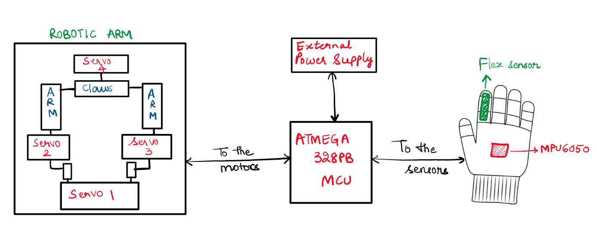

# FINAL PROJECT (TEAM 17)
## Project: MimicArm

* Team Name: **Code Cartel**
* Team Members: **Surya Sandeep Akella, Venkata Mahati Gollapudi**
* Github Repository URL: https://github.com/upenn-embedded/final-project-code-cartel
* Github Pages Website URL: https://sandeep0625.github.io/code_cartel_team17/

## Background

* The rapid advancement of technology has led to the development of human-computer interaction systems that aim to bridge the gap between humans and machines. 

* Gesture-based control systems, often inspired by natural human movements, are becoming increasingly significant in areas such as robotics, prosthetics, and assistive technology. 

* The use of IMU sensors, such as the MPU6050, and flex sensors enables capturing precise motion and bending data, which can be translated into real-time control signals for robotic systems. 

* This project explores the integration of these technologies to build a gesture-controlled robotic arm that responds intuitively to user inputs.

## Goal

* The primary goal of the project is to design and implement a gesture-controlled robotic arm that interprets hand gestures and finger movements to control its motion. 

* The system will:
    1. Accurately capture motion using an MPU6050 IMU for 3-axis angular velocity and a flex sensor for detecting finger bends.

    2. Translate captured data into PWM signals to drive servo motors that control the robotic arm's articulation.
    Provide smooth, real-time operation of the robotic arm while adhering to predefined motion limits to avoid mechanical damage.

    3. Demonstrate modularity and scalability, making it adaptable for various applications such as assistive devices, industrial automation, and educational tools.

## System Block Diagram

### **1. Video**

https://drive.google.com/file/d/1xXghiWyomHCL5a-zHVZRfuj0blY-f9e_/view?usp=sharing

### **2. Images**

<video controls src="WhatsApp Video 2024-11-14 at 22.03.03_528e18b5.mp4" title="Title"></video>

## **3. Results**

The Gesture-Controlled Robotic Arm successfully translated natural hand gestures into precise robotic movements using sensors and servo motors. The MPU6050 IMU detected 3-axis angular velocity for up/down and left/right movements, while a flex sensor controlled the claw's open/close action. Four motors were controlled via PWM signals generated by the ATmega328PB microcontroller. The system achieved real-time synchronization of sensor data and motor control with minimal latency. Robust hardware connections and an external power supply ensured stable motor performance. The robotic arm met all hardware and software specifications, demonstrating smooth and accurate operation during testing. This project provides a functional prototype for applications in robotics, with potential for future enhancements like wireless control or advanced gesture recognition.

#### Users

The primary users of the system include:

1. Robotics Enthusiasts: Hobbyists or students who want to learn about gesture-controlled systems.

2. Industrial Workers: For use in environments where direct manual operation is unsafe.

3. Educational Institutions: For teaching purposes in robotics, mechatronics, or control systems labs.

4. Medical Surgeies: For medical surgeries and assitance for doctors. 

### 3.1 Software Requirements Specification (SRS) 

SRS Validation

1. SRS 01:

    * The IMU 3-axis angular velocity will be measured with 16-bit depth every 100 milliseconds +/-10 milliseconds.

    * Validation:

        Achieved using the MPU6050 IMU sensor, which provides 16-bit data over I2C.
    Sampling interval was verified through a logic analyzer to ensure it adheres to the 100ms +/- 10ms requirement.

    * Proof of Work:

        Data logs from gyroscope readings show consistent sampling intervals.

2. SRS 02: 

    * The flex sensor data will be sampled at a resolution of 10 bits and mapped to a servo motor control angle.

    * Validation:

        ADC resolution of the ATmega328PB is 10 bits, meeting the requirement.
        Flex sensor values were successfully mapped to servo angles from 40° to 90° as per the design.

    * Proof of Work:

        ADC output values logged and mapped to corresponding motor angles.

3. SRS 03: 

    * The PWM signals will be generated for motor control with a frequency of 50Hz and a duty cycle range corresponding to angles from 30° to 180°.

    * Validation:
    
        PWM signals were generated with a 20ms period (50Hz) using Timer1, Timer3, and Timer4.
        Duty cycles corresponding to motor angles were measured with an oscilloscope.

    * Proof of Work:

        Oscilloscope screenshots showing correct PWM signal generation.

4. SRS 04: 
    
    * The robotic arm will respond to gestures with a delay of less than 100 milliseconds to ensure real-time operation.
    
    * Validation:
    
        Tested gesture detection and motor response time. The measured delay between gesture detection and motor response was within the required range.

    * Proof of Work:
        Videos of the robotic arm responding to gestures in real-time.

5. SRS 05: 
    * The software will clamp motor angles to avoid mechanical damage and keep within predefined limits.

    * Validation:

        Software implemented angle clamping for all motors:
        Up/Down: 120° to 180°
        Flex: 40° to 90°
        Forward/Backward: 120° to 180°
        Left/Right: 0° to 180°
    
    * Proof of Work:
    
        Logs of clamped angles and manual tests to ensure no mechanical damage.

### 3.2 Hardware Requirements Specification (HRS)

1. HRS 01: 

    * The project shall be based on the ATmega328PB microcontroller, operating at a frequency of 16MHz.

    * Validation:

        ATmega328PB configured and operated at 16MHz using an external crystal oscillator.

    * Proof of Work:

        Microcontroller successfully executed code for gesture-based control without timing issues.

2. HRS 02: 
    
    * An MPU6050 IMU sensor shall be used for detecting 3-axis angular velocity and motion, with a sampling interval of 100 milliseconds +/-10 milliseconds.

    * Validation:
        
        MPU6050 successfully interfaced with the microcontroller using I2C. Sampling interval verified using logic analyzer and data logs.

    * Proof of Work:
        
        Logs of gyroscope data with timestamps and consistent 100ms intervals.

3. HRS 03: 

    * A flex sensor shall be used to detect finger bending with an angular resolution mapped to servo motor positions.

    * Validation:

        Flex sensor data mapped to servo motor angles via ADC.

    * Proof of Work:

        ADC values logged and mapped angles tested with servo motion.

4. HRS 04: 

    * Servo motors will respond to PWM signals with angles ranging from 30° to 180° for precise robotic arm articulation.

    * Validation:

        Servo motors controlled using PWM generated by Timer1, Timer3, and Timer4.

    * Proof of Work:
        
        PWM signals verified using an oscilloscope, and motors demonstrated smooth motion across the specified range.

5. HRS 05: 

    * Power to the system will be provided through a 5V power supply for the microcontroller and peripherals, and a separate power source for the servo motors to prevent voltage drops.

    * Validation:
    
        Separate power sources tested to ensure stable operation without voltage drops or microcontroller resets.
    
    * Proof of Work:
        
        System operated continuously during testing with no power-related issues.

6. HRS 06: 
    
    * The system will include header pins or connectors for external components like sensors and motors to ensure modularity and ease of assembly.

    * Validation:
        
        Header pins used for connecting servos, MPU6050, and flex sensor for modular and accessible wiring.

    * Proof of Work:
    
        Testing setup showed ease of component replacement and reconnection.

## **4. Conclusion**

### What would we have done differently?

1. We would've incorporated wireless communication, such as Bluetooth or Wi-Fi, to enable remote control or monitoring of the robotic arm.
2. Worked on optimizing the physical design of the robotic arm for better strength, precision, and durability.

The Gesture-Controlled Robotic Arm project successfully demonstrates the integration of sensors, microcontrollers, and servo motors to create an intuitive and interactive system. By leveraging the MPU6050 IMU sensor and a flex sensor, the robotic arm translates natural hand gestures into precise motor movements, enabling control across multiple axes. The system is built around the reliable ATmega328PB microcontroller, ensuring efficient processing of sensor data and generation of PWM signals for servo control.

This project showcases the potential for gesture-based interfaces in applications such as assistive technologies, industrial automation, and remote operations. The design adheres to the specified hardware and software requirements, including accurate timing for IMU data sampling and smooth motion control through PWM signals. While the system performs reliably, potential future enhancements include optimizing sensor calibration, adding more degrees of freedom, and incorporating wireless communication for remote operation.

Overall, the project demonstrates a robust implementation of a gesture-controlled system and highlights its feasibility for practical use cases.